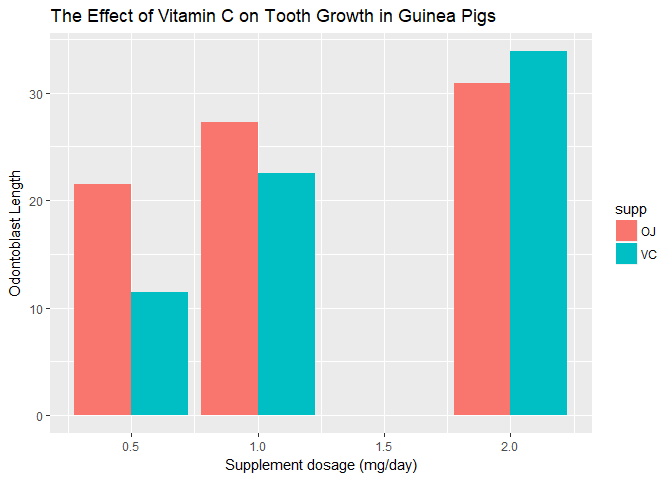

#Passenger Breakdown

```r
#This is where I will work on Assignment 0
#2.1 Passenger Breakdown

dataframe = data.frame(Titanic)

str(dataframe) #This str function allows the visualization of the dataset
```

```
## 'data.frame':	32 obs. of  5 variables:
##  $ Class   : Factor w/ 4 levels "1st","2nd","3rd",..: 1 2 3 4 1 2 3 4 1 2 ...
##  $ Sex     : Factor w/ 2 levels "Male","Female": 1 1 1 1 2 2 2 2 1 1 ...
##  $ Age     : Factor w/ 2 levels "Child","Adult": 1 1 1 1 1 1 1 1 2 2 ...
##  $ Survived: Factor w/ 2 levels "No","Yes": 1 1 1 1 1 1 1 1 1 1 ...
##  $ Freq    : num  0 0 35 0 0 0 17 0 118 154 ...
```

```r
Child = dataframe[dataframe$Age=="Child",] #List of the children on the Titanic
Adult = dataframe[dataframe$Age=="Adult",] #List of the adults on the Titanic
sum(Child$Freq) #This sum function will display the total number of children on the Titanic
```

```
## [1] 109
```

```r
sum(Adult$Freq) #This sum function will display the total number of adults on the Titanic
```

```
## [1] 2092
```

```r
sum(dataframe$Freq) # This sum function will display the total number of people on the Titanic
```

```
## [1] 2201
```

```r
Male = dataframe[dataframe$Sex=="Male",] #List of adult males on the Titanic
Female = dataframe[dataframe$sex=="Female",] #List of adult females on the Titanic
if(sum(Male$Freq) > sum(Female$Freq)) {Gender = "There were more males on the Titanic"} else {Gender = "There were more females on the Titanic"}
print(Gender) #This if-else statement indicates that there were more males on the Titanic
```

```
## [1] "There were more males on the Titanic"
```
#Survival

```r
#2.2 Survival
ChildrenSurvived = Child[Child$Survived=="Yes",] #Making a list of the children who survived
AdultsSurvived = Adult[Adult$Survived=="Yes",] #Making a list of the adults who survived
SurvivalRateC = sum(ChildrenSurvived$Freq)/sum(Child$Freq) #Calculating the survival rate of children on the Titanic
print(SurvivalRateC) #Printing the survival rate of the children
```

```
## [1] 0.5229358
```

```r
SurvivalRateA = sum(AdultsSurvived$Freq)/sum(Adult$Freq) #Calculating the survival rate of the adults on the Titanic
print(SurvivalRateA) #Printing the survival rate of the adults
```

```
## [1] 0.3126195
```

```r
if(SurvivalRateC > SurvivalRateA) {Survivors = "Children"} else {Survivors = "Adults"}
print(Survivors) #This if-else statement indicates that children have a higher survival rate
```

```
## [1] "Children"
```

```r
Crew = dataframe[dataframe$Class=="Crew",] #Creating a list of just the crew
FirstClass = dataframe[dataframe$Class=="1st",] #Creating a list of 1st class passengers 
SecondClass = dataframe[dataframe$Class=="2nd",] #Creating a list of 2nd class passengers
ThirdClass = dataframe[dataframe$Class=="3rd",] #Creating a list of 3rd class passengers
CrewSurvived = Crew[Crew$Survived=="Yes",] #Creating a second list of survived crew members
FirstClassSurvived = FirstClass[FirstClass$Survived=="Yes",] #Creating a second list of survived 1st class passengers
SecondClassSurvived = SecondClass[SecondClass$Survived=="Yes",] #Creating a second list of survived 2nd class passengers
ThirdClassSurvived = ThirdClass[ThirdClass$Survived=="Yes",] #Creating a second list of 3rd class passengers
SurvivalRateCrew = sum(CrewSurvived$Freq)/sum(Crew$Freq) #Calculating the crew members' survival rate
print(SurvivalRateCrew) #Printing survival rate of the crew
```

```
## [1] 0.239548
```

```r
SurvivalRateFirst = sum(FirstClassSurvived$Freq)/sum(FirstClass$Freq) #Calculating the 1st class passengers' survival rate
print(SurvivalRateFirst) #Printing survival rate
```

```
## [1] 0.6246154
```

```r
SurvivalRateSecond = sum(SecondClassSurvived$Freq)/sum(SecondClass$Freq) #Calculating the 2nd class passengers' survival rate
print(SurvivalRateSecond) #Printing survival rate
```

```
## [1] 0.4140351
```

```r
SurvivalRateThird = sum(ThirdClassSurvived$Freq)/sum(ThirdClass$Freq) #Calculating the 3rd class passengers' survival rate
print(SurvivalRateThird) #Printing survival rate
```

```
## [1] 0.2521246
```

```r
SurvivalList <- c(SurvivalRateCrew, SurvivalRateFirst, SurvivalRateSecond, SurvivalRateThird) #A list to compile the 4 survival rates
ClassList <- c("Crew", "1stClass", "2ndClass", "3rdClass") #A list to hold the names of the 4 classes in the same order as the SurvivalList
print(ClassList[which.max(SurvivalList)]) #The highest value in the SurvivalList will be used to print the name of from the ClassList using the which.max function
```

```
## [1] "1stClass"
```
#Data Visualization

```r
#Note that the toothGrowth data needs to be called by read.table function)
library(tidyverse)
```

```
## -- Attaching packages ----------------------------------------------------------------------------------------- tidyverse 1.2.1 --
```

```
## v ggplot2 2.2.1     v purrr   0.2.4
## v tibble  1.4.1     v dplyr   0.7.4
## v tidyr   0.7.2     v stringr 1.2.0
## v readr   1.1.1     v forcats 0.2.0
```

```
## -- Conflicts -------------------------------------------------------------------------------------------- tidyverse_conflicts() --
## x dplyr::filter() masks stats::filter()
## x dplyr::lag()    masks stats::lag()
```

```r
ToothData = read.table("https://raw.githubusercontent.com/STAT540-UBC/STAT540-UBC.github.io/master/homework/practice_assignment/guinea_pigs_tooth_growth.txt", header = TRUE) #This read.table function is loading the data from a website
str(ToothData) #
```

```
## 'data.frame':	60 obs. of  3 variables:
##  $ len : num  4.2 11.5 7.3 5.8 6.4 10 11.2 11.2 5.2 7 ...
##  $ supp: Factor w/ 2 levels "OJ","VC": 2 2 2 2 2 2 2 2 2 2 ...
##  $ dose: num  0.5 0.5 0.5 0.5 0.5 0.5 0.5 0.5 0.5 0.5 ...
```

```r
ggplot(data = ToothData) #This str function helps us visualize the data in a compact form
```

<!-- -->

```r
  geom_bar(mapping = aes(x=dose, y=len, fill=supp), position = "dodge",
           stat = 'identity', ggtitle = "The Effect of Vitamin C on Tooth Growth in Guinea Pigs", xlab = "Dosage mg/day", ylab = "Odontoblast Length")
```

```
## Warning: Ignoring unknown parameters: ggtitle, xlab, ylab
```

```
## mapping: x = dose, y = len, fill = supp 
## geom_bar: width = NULL, na.rm = FALSE
## stat_identity: na.rm = FALSE
## position_dodge
```
#


