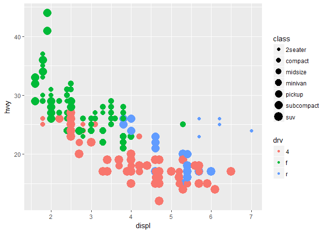

#Part1: First Time ggplot-ing

```r
library(tidyverse)
```

```
## -- Attaching packages ----------------------------------------------------------- tidyverse 1.2.1 --
```

```
## v ggplot2 2.2.1     v purrr   0.2.4
## v tibble  1.4.1     v dplyr   0.7.4
## v tidyr   0.7.2     v stringr 1.2.0
## v readr   1.1.1     v forcats 0.2.0
```

```
## -- Conflicts -------------------------------------------------------------- tidyverse_conflicts() --
## x dplyr::filter() masks stats::filter()
## x dplyr::lag()    masks stats::lag()
```

```r
ggplot(data = mpg) +
  geom_point(mapping = aes(x = displ, y = hwy), color = "blue")
```

<!-- -->

#Part2: The layered grammar

```r
apropos("^geom_")
```

```
##  [1] "geom_abline"     "geom_area"       "geom_bar"       
##  [4] "geom_bin2d"      "geom_blank"      "geom_boxplot"   
##  [7] "geom_col"        "geom_contour"    "geom_count"     
## [10] "geom_crossbar"   "geom_curve"      "geom_density"   
## [13] "geom_density_2d" "geom_density2d"  "geom_dotplot"   
## [16] "geom_errorbar"   "geom_errorbarh"  "geom_freqpoly"  
## [19] "geom_hex"        "geom_histogram"  "geom_hline"     
## [22] "geom_jitter"     "geom_label"      "geom_line"      
## [25] "geom_linerange"  "geom_map"        "geom_path"      
## [28] "geom_point"      "geom_pointrange" "geom_polygon"   
## [31] "geom_qq"         "geom_quantile"   "geom_raster"    
## [34] "geom_rect"       "geom_ribbon"     "geom_rug"       
## [37] "geom_segment"    "geom_smooth"     "geom_spoke"     
## [40] "geom_step"       "geom_text"       "geom_tile"      
## [43] "geom_violin"     "geom_vline"
```

```r
apropos("stat_")
```

```
##  [1] "stat_bin"             "stat_bin_2d"          "stat_bin_hex"        
##  [4] "stat_bin2d"           "stat_binhex"          "stat_boxplot"        
##  [7] "stat_contour"         "stat_count"           "stat_density"        
## [10] "stat_density_2d"      "stat_density2d"       "stat_ecdf"           
## [13] "stat_ellipse"         "stat_function"        "stat_identity"       
## [16] "stat_qq"              "stat_quantile"        "stat_smooth"         
## [19] "stat_spoke"           "stat_sum"             "stat_summary"        
## [22] "stat_summary_2d"      "stat_summary_bin"     "stat_summary_hex"    
## [25] "stat_summary2d"       "stat_unique"          "stat_ydensity"       
## [28] "update_stat_defaults"
```

```r
apropos("^scale_")
```

```
##  [1] "scale_alpha"               "scale_alpha_continuous"   
##  [3] "scale_alpha_discrete"      "scale_alpha_identity"     
##  [5] "scale_alpha_manual"        "scale_color_brewer"       
##  [7] "scale_color_continuous"    "scale_color_discrete"     
##  [9] "scale_color_distiller"     "scale_color_gradient"     
## [11] "scale_color_gradient2"     "scale_color_gradientn"    
## [13] "scale_color_grey"          "scale_color_hue"          
## [15] "scale_color_identity"      "scale_color_manual"       
## [17] "scale_colour_brewer"       "scale_colour_continuous"  
## [19] "scale_colour_date"         "scale_colour_datetime"    
## [21] "scale_colour_discrete"     "scale_colour_distiller"   
## [23] "scale_colour_gradient"     "scale_colour_gradient2"   
## [25] "scale_colour_gradientn"    "scale_colour_grey"        
## [27] "scale_colour_hue"          "scale_colour_identity"    
## [29] "scale_colour_manual"       "scale_fill_brewer"        
## [31] "scale_fill_continuous"     "scale_fill_date"          
## [33] "scale_fill_datetime"       "scale_fill_discrete"      
## [35] "scale_fill_distiller"      "scale_fill_gradient"      
## [37] "scale_fill_gradient2"      "scale_fill_gradientn"     
## [39] "scale_fill_grey"           "scale_fill_hue"           
## [41] "scale_fill_identity"       "scale_fill_manual"        
## [43] "scale_linetype"            "scale_linetype_continuous"
## [45] "scale_linetype_discrete"   "scale_linetype_identity"  
## [47] "scale_linetype_manual"     "scale_radius"             
## [49] "scale_shape"               "scale_shape_continuous"   
## [51] "scale_shape_discrete"      "scale_shape_identity"     
## [53] "scale_shape_manual"        "scale_size"               
## [55] "scale_size_area"           "scale_size_continuous"    
## [57] "scale_size_date"           "scale_size_datetime"      
## [59] "scale_size_discrete"       "scale_size_identity"      
## [61] "scale_size_manual"         "scale_x_continuous"       
## [63] "scale_x_date"              "scale_x_datetime"         
## [65] "scale_x_discrete"          "scale_x_log10"            
## [67] "scale_x_reverse"           "scale_x_sqrt"             
## [69] "scale_x_time"              "scale_y_continuous"       
## [71] "scale_y_date"              "scale_y_datetime"         
## [73] "scale_y_discrete"          "scale_y_log10"            
## [75] "scale_y_reverse"           "scale_y_sqrt"             
## [77] "scale_y_time"
```

```r
ggplot(data = mpg, 
       mapping = aes(x = displ, y = hwy)) +
  geom_point() +
  geom_smooth()
```

```
## `geom_smooth()` using method = 'loess'
```

<!-- -->

#Part3: Deliverable

```r
ggplot(data = mpg, mapping = aes(x = displ, y = hwy, color = drv, size = class)) + geom_point() 
```

```
## Warning: Using size for a discrete variable is not advised.
```

<!-- -->
