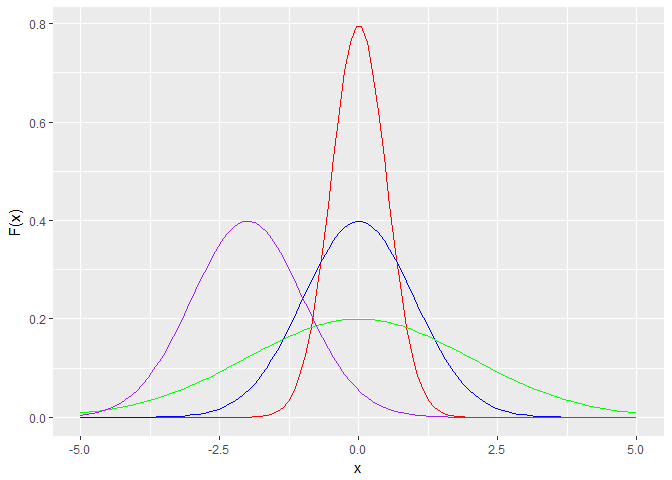
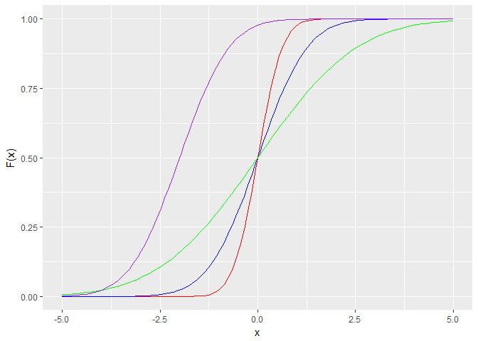
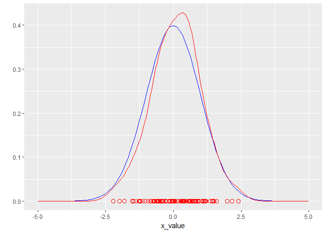
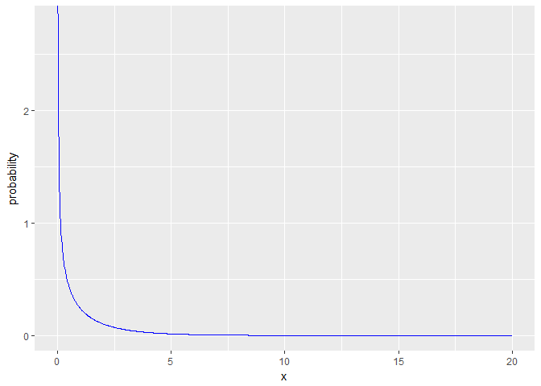
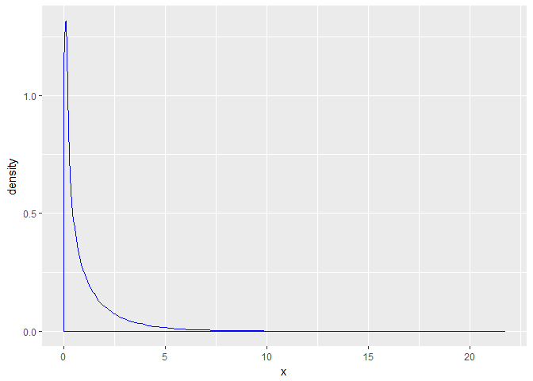
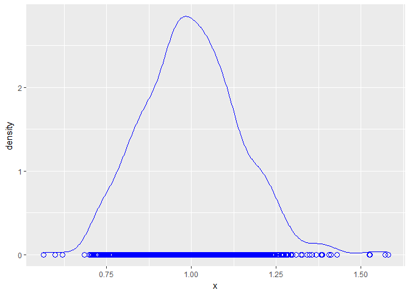
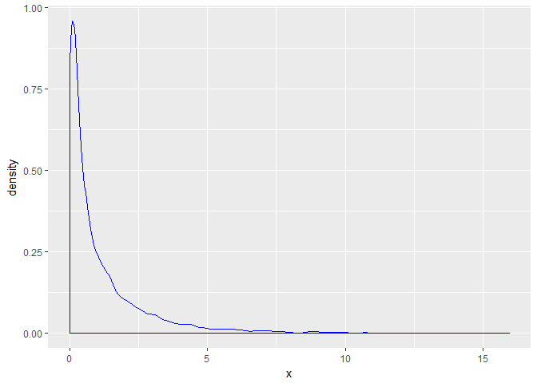
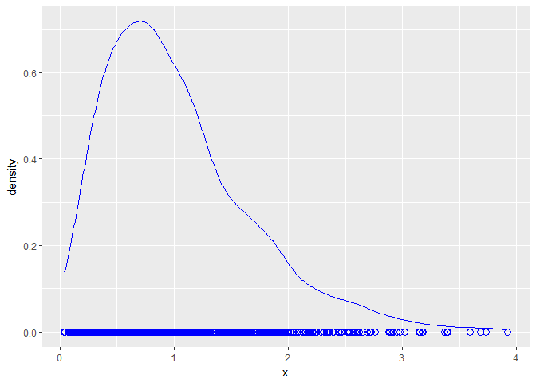

#The Normal Distribution


```r
library(tidyverse)
```

```
## -- Attaching packages ------------------------------------------------------------ tidyverse 1.2.1 --
```

```
## v ggplot2 2.2.1     v purrr   0.2.4
## v tibble  1.4.1     v dplyr   0.7.4
## v tidyr   0.7.2     v stringr 1.2.0
## v readr   1.1.1     v forcats 0.2.0
```

```
## -- Conflicts --------------------------------------------------------------- tidyverse_conflicts() --
## x dplyr::filter() masks stats::filter()
## x dplyr::lag()    masks stats::lag()
```

```r
#The probability density function
xValues = seq(from = -5, to = 5, length = 100)
plotA = dnorm(xValues, mean = 0, sd = 0.5)
plotB = dnorm(xValues, mean = 0, sd = 1)
plotC = dnorm(xValues, mean = 0, sd = 2)
plotD = dnorm(xValues, mean = -2, sd =1)

normalDistributionsTibble = tibble(x_value = xValues,
                                   red_value = plotA,
                                   blue_value = plotB,
                                   green_value = plotC,
                                   purple_value = plotD)

p = normalDistributionsTibble %>% ggplot()
p + 
  geom_line(aes(x = xValues, y = red_value), color = "red") +
  geom_line(aes(x = xValues, y = blue_value), color = "blue") +
  geom_line(aes(x = xValues, y = green_value), color = "green") +
  geom_line(aes(x = xValues, y = purple_value), color = "purple") +
  xlab("x") +
  ylab("F(x)")
```

<!-- -->

```r
#The Cumulative Distribution Function (CDF)
xValues = seq(from = -5, to = 5, length = 100)
plotA = pnorm(xValues, mean = 0, sd = 0.5)
plotB = pnorm(xValues, mean = 0, sd = 1)
plotC = pnorm(xValues, mean = 0, sd = 2)
plotD = pnorm(xValues, mean = -2, sd =1)

normalDistributionsTibble = tibble(x_value = xValues,
                                   red_value = plotA,
                                   blue_value = plotB,
                                   green_value = plotC,
                                   purple_value = plotD)

p = normalDistributionsTibble %>% ggplot()
p + 
  geom_line(aes(x = xValues, y = red_value), color = "red") +
  geom_line(aes(x = xValues, y = blue_value), color = "blue") +
  geom_line(aes(x = xValues, y = green_value), color = "green") +
  geom_line(aes(x = xValues, y = purple_value), color = "purple") +
  xlab("x") +
  ylab("F(x)")
```

<!-- -->

```r
#Simulation vs. perfect distribution
meanValue = 0
standardDeviation = 1
numVals = 100

xValues = seq(from = -5, to = 5, length = numVals)
trueDistribution = dnorm(xValues, mean = meanValue, sd = standardDeviation)

dataFrame = tibble(x_value = xValues, true_value = trueDistribution)

set.seed(1)
randomVals = rnorm(numVals, mean = meanValue, sd = standardDeviation)

dataFrame %>% ggplot() +
  geom_line(aes(x = x_value, y = true_value), color = "blue") +
  geom_line(aes(x = randomVals), color = "red", stat = "density") +
  geom_point(aes(x = randomVals, y = 0), color = "red", shape = 1, size = 3) +
  ylab("")
```

<!-- -->

#Part2: The Central Limit Theorem (CLT)


```r
library(tidyverse)
degreeFreedom = 1
xValues = seq(from = 0, to = 20, length = 1000)
probabilityValues = dchisq(xValues, df = degreeFreedom)

dataFrame = tibble(x = xValues,
                   probability = probabilityValues)
dataFrame %>% ggplot() +
  geom_line(aes(x = x, y = probability), color = "blue")
```

<!-- -->

```r
#Stimulating many samples
set.seed(1)

sampleSize = 100
numSamples = 1000

degreeFreedom = 1

randomChiSqValues = rchisq(n = numSamples * sampleSize, df = degreeFreedom)
tibble(x = randomChiSqValues) %>% 
  ggplot() + 
  geom_density(aes(x = x), color = "blue")
```

<!-- -->

```r
samples <- matrix(randomChiSqValues, nrow = numSamples, ncol = sampleSize)
sampleMeans <- rowMeans(samples) # work out the sample means 

head(sampleMeans)
```

```
## [1] 1.0797031 1.1752284 0.9261440 0.9416424 0.9380011 1.1191603
```

```r
tibble(x = sampleMeans) %>% 
  ggplot() + 
  geom_line(aes(x = x), stat = "density", color = "blue") +
  geom_point(aes(x = x, y = 0), color = "blue", shape = 1, size = 3)
```

<!-- -->

#Part 3: Deliverables


```r
set.seed(1)

sampleSize = 5
numSamples = 1000

degreeFreedom = 1

randomChiSqValues = rchisq(n = numSamples * sampleSize, df = degreeFreedom)
tibble(x = randomChiSqValues) %>% 
  ggplot() + 
  geom_density(aes(x = x), color = "blue")
```

<!-- -->

```r
samples <- matrix(randomChiSqValues, nrow = numSamples, ncol = sampleSize)
sampleMeans <- rowMeans(samples) # work out the sample means 

head(sampleMeans)
```

```
## [1] 0.9271741 1.3116297 0.5027606 0.3370594 2.0871492 0.3149406
```

```r
tibble(x = sampleMeans) %>% 
  ggplot() + 
  geom_line(aes(x = x), stat = "density", color = "blue") +
  geom_point(aes(x = x, y = 0), color = "blue", shape = 1, size = 3)
```

<!-- -->
